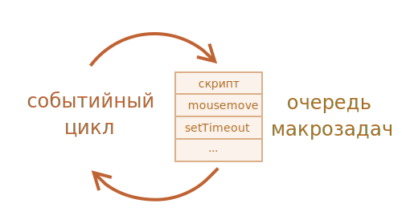
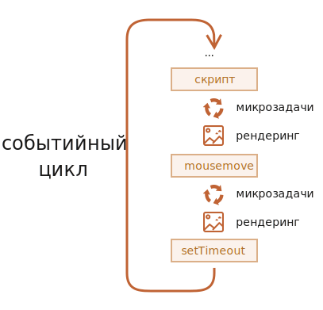

# Событийный цикл: микрозадачи и макрозадачи

Поток выполнения в браузере, равно как и в Node.js, основан на событийном цикле.

*Идея событийного цикла очень проста. Есть бесконечный цикл, в котором движок JavaScript ожидает задачи, исполняет их и снова ожидает появления новых.*

Общий алгоритм движка:
1. Пока есть задачи:
- выполнить их, начиная с самой старой
2. Бездействовать до появления новой задачи, а затем перейти к пункту 1

Может так случиться, что задача поступает, когда движок занят чем-то другим, тогда она ставится в очередь.

Очередь, которую формируют такие задачи, называют «очередью макрозадач» (macrotask queue, термин V8).


Например, когда движок занят выполнением скрипта, пользователь может передвинуть мышь, тем самым вызвав появление события mousemove, или может истечь таймер, установленный setTimeout, и т.п. Эти задачи формируют очередь, как показано на иллюстрации выше.

Задачи из очереди исполняются по правилу «первым пришёл – первым ушёл». Когда браузер заканчивает выполнение скрипта, он обрабатывает событие mousemove, затем выполняет обработчик, заданный setTimeout, и так далее.

Отметим две детали:
1. Рендеринг (отрисовка страницы) никогда не происходит во время выполнения задачи движком. Не имеет значения, сколь долго выполняется задача. Изменения в DOM отрисовываются только после того, как задача выполнена.
2. Если задача выполняется очень долго, то браузер не может выполнять другие задачи, обрабатывать пользовательские события, поэтому спустя некоторое время браузер предлагает «убить» долго выполняющуюся задачу. Такое возможно, когда в скрипте много сложных вычислений или ошибка, ведущая к бесконечному циклу.

# Пример 1: разбиение «тяжёлой» задачи.

Если вы запустите код ниже, движок «зависнет» на некоторое время. Для серверного JS это будет явно заметно, а если вы будете выполнять этот код в браузере, то попробуйте понажимать другие кнопки на странице – вы заметите, что никакие другие события не обрабатываются до завершения функции счёта.
```js
let i = 0;
let start = Date.now();
function count() {
  // делаем тяжёлую работу
  for (let j = 0; j < 1e9; j++) { i++; }

  alert("Done in " + (Date.now() - start) + 'ms');
}
count();
```
Давайте разобьём задачу на части, воспользовавшись вложенным setTimeout:
```js
let i = 0;
let start = Date.now();
function count() {
  // делаем часть тяжёлой работы (*)
  do {
    i++;
  } while (i % 1e6 != 0);
  if (i == 1e9) {
    alert("Done in " + (Date.now() - start) + 'ms');
  } else {
    setTimeout(count); // планируем новый вызов (**)
  }
}
count();
```
Теперь интерфейс браузера полностью работоспособен во время выполнения «счёта».\
Теперь если новая сторонняя задача (например, событие onclick) появляется, пока движок занят выполнением 1-й части, то она становится в очередь, и затем выполняется, когда 1-я часть завершена, перед следующей частью. Периодические возвраты в событийный цикл между запусками count дают движку достаточно «воздуха», чтобы сделать что-то ещё, отреагировать на действия пользователя.\
Итак, мы разбили ресурсоёмкую задачу на части – теперь она не блокирует пользовательский интерфейс, причём почти без потерь в общем времени выполнения.

# Пример 2: индикация прогресса

# Пример 3: делаем что-нибудь после события

# Макрозадачи и Микрозадачи

Микрозадачи приходят только из кода. Обычно они создаются промисами: выполнение обработчика .then/catch/finally становится микрозадачей. Микрозадачи также используются «под капотом» await, т.к. это форма обработки промиса.

Также есть специальная функция queueMicrotask(func), которая помещает func в очередь микрозадач.

*Сразу после каждой макрозадачи движок исполняет все задачи из очереди микрозадач перед тем, как выполнить следующую макрозадачу или отобразить изменения на странице, или сделать что-то ещё.*
```js
setTimeout(() => alert("timeout"));

Promise.resolve()
  .then(() => alert("promise"));

alert("code");
```
Какой здесь будет порядок?
- `code` появляется первым, т.к. это обычный синхронный вызов.
- `promise` появляется вторым, потому что .then проходит через очередь микрозадач и выполняется после текущего синхронного кода.
- `timeout` появляется последним, потому что это макрозадача.


*Все микрозадачи завершаются до обработки каких-либо событий или рендеринга, или перехода к другой макрозадаче.*

Это важно, так как гарантирует, что общее окружение остаётся одним и тем же между микрозадачами – не изменены координаты мыши, не получены новые данные по сети и т.п.

Если мы хотим запустить функцию асинхронно (после текущего кода), но до отображения изменений и до новых событий, то можем запланировать это через queueMicrotask.

# Event Loop в деталях

JS был спроектирован как однопоточный язык программирования. Это значит, что он может выполнять только одну операцию одновременно.  Тем не менее у JavaScript есть такой механизм как Event Loop, который как раз и позволяет выполнять "асинхронные" операции.  Да просто потому что JavaScript тоже выполняет их синхронно, асинхронности в самом JavaScript как таковой нет.

Тут в силу и вступает Event Loop. Так как setTimeout это асинхронная операция (таймер высчитывается на стороне браузера, а не в JS).

Другое дело обстоит с таймером, время которое ожидает таймаут будет считаться на стороне браузера, поэтому операция как бы "пропадет" из очереди. Таймер попал в Event Loop, где будет ждать покуда браузер не пришлет сигнал, о том что время для таймаута вышло и коллбэк внутри таймера можно выполнять.

Теперь самое неочевидное: даже если таймаут выполнился, а функция в которой мы выполняем все синхронные операции еще не выполнилась, Event Loop будет держать все что в нем содержится, покуда у нас не очистится Call Stack. Только после того как все синхронные операции в функции выполнились Event Loop отдаст нам наш таймер, который мы сможем выполнить:

Однако у Event Loop'а тоже есть свои правила. Он делит все задачи на подтипы:
- Микрозадачи
- Макрозадачи
- Задачи отрисовки

Движок у нас отвечает:
- сборку мусора
- стек вызовов Call Stack и куча Cheap
- Компиляция JS в машинный код
- Отпимизация, скрытые классы

Event-loop:
- асинхронный-код

Event-loop не является частью движка, а предоставляется средой.
Браузер nodejs или другой. Устройство может быть разной.

В Chrome - v8 и в NodeJs- v8.

Взаимодействие между event-loop и движка через web-api.

Синхронные задачи выполняются в Call Stack.
Очередь микрозадач и очень макрозадач.

МИкратаски:
1 Промисы
2 queueMicrotask
3 mutationObserver

МАкротаски:
- Таймеры (setTimeout, setInterval)
- События (клик, загрузка изображений)
- Браузерные нюансы (рендер, I/O)

# await

`await` заставляет асинхронную функцию ждать выполнение промиса (его значения). Чтобы получить значение выполненного промиса, мы должны присвоить переменной ожидаемое (awaited) значение промиса.

```js
const one = () => Promise.resolve('One!');

async function myFunc() {
  console.log('In function!');
  const res = await one();
  console.log(res);
}

console.log('Before functions');
myFunc();
console.log('After function!')
```

```js
```

```js
```

```js
```

```js
```

```js
```
