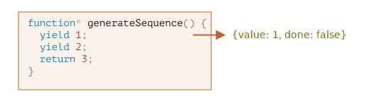

# Генераторы

Обычные функции возвращают только одно-единственное значение (или ничего).

Генераторы могут порождать (yield  /jiːld/) множество значений одно за другим, по мере необходимости. Генераторы отлично работают с перебираемыми объектами и позволяют легко создавать потоки данных.

## Функция-генератор

Для объявления генератора используется специальная синтаксическая конструкция: `function*`, которая называется «функция-генератор».

```js
function* generateSequence() {
  yield 1;
  yield 2;
  return 3;
}
// "функция-генератор" создаёт объект "генератор"
let generator = generateSequence();
alert(generator); // [object Generator]

let one = generator.next();
alert(JSON.stringify(one)); // {value: 1, done: false}
```
Функции-генераторы ведут себя не так, как обычные. Когда такая функция вызвана, она не выполняет свой код. Вместо этого она возвращает специальный объект, так называемый «генератор», для управления её выполнением.
- Выполнение кода функции ещё не началось.

Основным методом генератора является `next()`. При вызове он запускает выполнение кода до ближайшей инструкции `yield <значение>` (значение может отсутствовать, в этом случае оно предполагается равным `undefined`). По достижении `yield` выполнение функции приостанавливается, а соответствующее значение – возвращается во внешний код.\
Результатом метода `next()` всегда является объект с двумя свойствами:
1. `value`: значение из `yield`.
2. `done: true`, если выполнение функции завершено, иначе `false`.

На данный момент мы получили только первое значение, выполнение функции остановлено на второй строке.


И, наконец, последний вызов завершит выполнение функции и вернёт результат `return`.

Сейчас генератор полностью выполнен. Мы можем увидеть это по свойству `done:true` и обработать `value:3` как окончательный результат.

Новые вызовы `generator.next()` больше не имеют смысла. Впрочем, если они и будут, то не вызовут ошибки, но будут возвращать один и тот же объект: {done: true}.

- так как звёздочка относится к типу объявляемой сущности (`function*` – «функция-генератор»), а не к её названию, так что резонно расположить её у слова `function`.

## Перебор генераторов

- Как вы, наверное, уже догадались по наличию метода `next()`, генераторы являются перебираемыми объектами.
- Возвращаемые ими значения можно перебирать через `for..of`:
```js
for(let value of generator) {
  alert(value); // 1, затем 2, затем 3
}

function* generateSequence() {
  yield 1;
  yield 2;
  yield 3;
}

let generator = generateSequence();

for(let value of generator) {
  alert(value); // 1, затем 2, затем 3
}

let sequence = [0, ...generateSequence()];
alert(sequence); // 0, 1, 2, 3
```
Это из-за того, что перебор через `for..of` игнорирует последнее значение, при котором done: true. Поэтому, если мы хотим, чтобы были все значения при переборе через `for..of`, то надо возвращать их через `yield`.
- Так как генераторы являются перебираемыми объектами, мы можем использовать всю связанную с ними функциональность, например оператор расширения `...`.

## Использование генераторов для перебираемых объектов
Мы создавали перебираемый объект
```js
let range = {
  from: 1,
  to: 5,

  // for..of range вызывает этот метод один раз в самом начале
  [Symbol.iterator]() {
    // ...он возвращает перебираемый объект:
    // далее for..of работает только с этим объектом, запрашивая следующие значения
    return {
      current: this.from,
      last: this.to,

      // next() вызывается при каждой итерации цикла for..of
      next() {
        // нужно вернуть значение как объект {done:.., value :...}
        if (this.current <= this.last) {
          return { done: false, value: this.current++ };
        } else {
          return { done: true };
        }
      }
    };
  }
};
// при переборе объекта range будут выведены числа от range.from до range.to
alert([...range]); // 1,2,3,4,5
```
Мы можем использовать функцию-генератор для итерации, указав её в `Symbol.iterator`.
```js
// Вот тот же range, но с гораздо более компактным итератором:
let range = {
  from: 1,
  to: 5,

  *[Symbol.iterator]() { // краткая запись для [Symbol.iterator]: function*()
    for(let value = this.from; value <= this.to; value++) {
      yield value;
    }
  }
};
alert( [...range] ); // 1,2,3,4,5
```
Это работает, потому что `range[Symbol.iterator]()` теперь возвращает генератор, и его методы – в точности то, что ожидает `for..of`:
1. у него есть метод .next()
2. который возвращает значения в виде {value: ..., done: true/false}\
[Это не совпадение, конечно. Генераторы были добавлены в язык JavaScript, в частности, с целью упростить создание перебираемых объектов.]

## Композиция генераторов

Композиция генераторов – это особенная возможность генераторов, которая позволяет прозрачно «встраивать» генераторы друг в друга.

Для генераторов есть особый синтаксис `yield*`, который позволяет «вкладывать» генераторы один в другой (осуществлять их композицию).
```js
function* generateSequence(start, end) {
  for (let i = start; i <= end; i++) yield i;
}

function* generatePasswordCodes() {
  // 0..9
  yield* generateSequence(48, 57);
  // A..Z
  yield* generateSequence(65, 90);
  // a..z
  yield* generateSequence(97, 122);
}
let str = '';
for(let code of generatePasswordCodes()) {
  str += String.fromCharCode(code);
}

alert(str); // 0..9A..Za..z
```
Директива `yield*` делегирует выполнение другому генератору. Этот термин означает, что `yield* gen` перебирает генератор `gen` и прозрачно направляет его вывод наружу. Как если бы значения были сгенерированы внешним генератором.\
[Композиция генераторов – естественный способ вставлять вывод одного генератора в поток другого. Она не использует дополнительную память для хранения промежуточных результатов.]

## yield – дорога в обе стороны

Всё дело в том, что `yield` – дорога в обе стороны: он не только возвращает результат наружу, но и может передавать значение извне в генератор.\
Чтобы это сделать, нам нужно вызвать `generator.next(arg)` с аргументом. Этот аргумент становится результатом `yield`.
```js
function* gen() {
  // Передаём вопрос во внешний код и ожидаем ответа
  let result = yield "2 + 2 = ?"; // (*)
  alert(result);
}
let generator = gen();
let question = generator.next().value; // <-- yield возвращает значение
generator.next(4); // --> передаём результат в генератор
```
[Обратите внимание, что внешний код не обязан немедленно вызывать `next(4)`. Ему может потребоваться время. Это не проблема, генератор подождёт.]
```js
// возобновить генератор через некоторое время
setTimeout(() => generator.next(4), 1000);
```
- Как видно, в отличие от обычных функций, генератор может обмениваться результатами с вызывающим кодом, передавая значения в next/yield.
```js
function* gen() {
  let ask1 = yield "2 + 2 = ?";

  alert(ask1); // 4

  let ask2 = yield "3 * 3 = ?"

  alert(ask2); // 9
}
let generator = gen();
alert( generator.next().value ); // "2 + 2 = ?"

alert( generator.next(4).value ); // "3 * 3 = ?"

alert( generator.next(9).done ); // true
```
1. Первый `.next()` начинает выполнение… Оно доходит до первого yield.
Результат возвращается во внешний код.
2. Второй `.next(4)` передаёт 4 обратно в генератор как результат первого yield и возобновляет выполнение.
…Оно доходит до второго yield, который станет результатом .next(4).
3. Третий `next(9)` передаёт 9 в генератор как результат второго yield и возобновляет выполнение, которое завершается окончанием функции, так что done: true.
   
[Получается такой «пинг-понг»: каждый next(value) передаёт в генератор значение, которое становится результатом текущего yield, возобновляет выполнение и получает выражение из следующего yield.]

## generator.throw

Как мы видели в примерах выше, внешний код может передавать значение в генератор как результат `yield`.\
…Но можно передать не только результат, но и инициировать ошибку. Это естественно, так как ошибка является своего рода результатом.\
Для того, чтобы передать ошибку в `yield`, нам нужно вызвать `generator.throw(err)`. В таком случае исключение `err` возникнет на строке с `yield`.
```js
function* gen() {
  try {
    let result = yield "2 + 2 = ?"; // (1)

    alert("Выполнение программы не дойдёт до этой строки, потому что выше возникнет исключение");
  } catch(e) {
    alert(e); // покажет ошибку
  }
}

let generator = gen();

let question = generator.next().value;

generator.throw(new Error("Ответ не найден в моей базе данных")); // (2)
```
[Ошибка, которая проброшена в генератор на строке (2), приводит к исключению на строке (1) с yield. В примере выше try..catch перехватывает её и отображает.\
Если мы не хотим перехватывать её, то она, как и любое обычное исключение, «вывалится» из генератора во внешний код.\
Если же ошибка и там не перехвачена, то дальше – как обычно, она выпадает наружу и, если не перехвачена, «повалит» скрипт.]

# Асинхронные итераторы и генераторы

Асинхронные итераторы позволяют перебирать данные, поступающие асинхронно. Например, когда мы загружаем что-то по частям по сети. Асинхронные генераторы делают такой перебор ещё удобнее.

## Асинхронные итераторы
- Оператор расширения `...` не работает асинхронно.\
[Это естественно, так как он ожидает Symbol.iterator, как и for..of без await. Ему не подходит Symbol.asyncIterator.]

Чтобы сделать объект итерируемым асинхронно:
1. Используется `Symbol.asyncIterator` вместо `Symbol.iterator`.
2. `next()` должен возвращать промис.
3. Чтобы перебрать такой объект, используется цикл `for await (let item of iterable)`.
```js
let range = {
  from: 1,
  to: 5,
  // for await..of вызывает этот метод один раз в самом начале
  [Symbol.asyncIterator]() { // (1)
    // ...возвращает объект-итератор:
    // далее for await..of работает только с этим объектом,
    // запрашивая у него следующие значения вызовом next()
    return {
      current: this.from,
      last: this.to,

      // next() вызывается на каждой итерации цикла for await..of
      async next() { // (2)
        // должен возвращать значение как объект {done:.., value :...}
        // (автоматически оборачивается в промис с помощью async)

        // можно использовать await внутри для асинхронности:
        await new Promise(resolve => setTimeout(resolve, 1000)); // (3)

        if (this.current <= this.last) {
          return { done: false, value: this.current++ };
        } else {
          return { done: true };
        }
      }
    };
  }
};
alert( [...range] ); // Ошибка, нет Symbol.iterator

(async () => {
  for await (let value of range) { // (4)
    alert(value); // 1,2,3,4,5
  }
})()
```
## Асинхронные генераторы
Как мы уже знаем, в JavaScript есть генераторы, и они являются перебираемыми.

Нет проблем, просто добавьте в начале async, например, вот так:
```js
async function* generateSequence(start, end) {
  for (let i = start; i <= end; i++) {
    // ура, можно использовать await!
    await new Promise(resolve => setTimeout(resolve, 1000));
    yield i;
  }
}

(async () => {
  let generator = generateSequence(1, 5);
  for await (let value of generator) {
    alert(value); // 1, потом 2, потом 3, потом 4, потом 5
  }
})();

result = await generator.next(); // result = {value: ..., done: true/false}
```
- Теперь у нас есть асинхронный генератор, который можно перебирать с помощью `for await ... of`.
- С технической точки зрения, ещё одно отличие асинхронного генератора заключается в том, что его метод `generator.next()` теперь тоже асинхронный и возвращает промисы.
