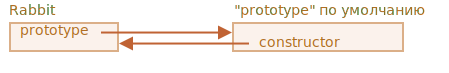

# Прототипное наследование

### [[Prototype]]

В JavaScript объекты имеют специальное скрытое свойство `[[Prototype]]` (так оно названо в спецификации), которое либо равно `null`, либо ссылается на другой объект. Этот объект называется «прототип»:


Когда мы хотим прочитать свойство из object, а оно отсутствует, JavaScript автоматически берёт его из прототипа. В программировании такой механизм называется «прототипным наследованием». Многие интересные возможности языка и техники программирования основываются на нём.

Свойство `[[Prototype]]` является внутренним и скрытым, но есть много способов задать его:
1. Использование `__proto__`
```js
let animal = {
  eats: true
    walk() {
    alert("Animal walk");
  }
};
let rabbit = {
  jumps: true
};
// устанавливает animal как прототип для rabbit
rabbit.__proto__ = animal;

// теперь мы можем найти оба свойства в rabbit:
rabbit.eats; // true (**)
rabbit.jumps; // true
// Или
let rabbit = {
  jumps: true,
  __proto__: animal
};
// walk взят из прототипа
rabbit.walk(); // Animal walk

// Цепочка прототипов может быть длиннее:
let third = {
  earLength: 10,
  __proto__: rabbit
};
// walk взят из цепочки прототипов
third.walk(); // Animal walk
```
Если мы ищем свойство в rabbit, а оно отсутствует, JavaScript автоматически берёт его из animal.\
когда alert пытается прочитать свойство rabbit.eats, его нет в rabbit, поэтому JavaScript следует по ссылке [[Prototype]] и находит его в animal.\


*Здесь мы можем сказать, что "animal является прототипом rabbit" или "rabbit прототипно наследует от animal"*.\
Так что если у animal много полезных свойств и методов, то они автоматически становятся доступными у rabbit. *Такие свойства называются «унаследованными».*

Цепочка прототипов может быть длиннее:


Если мы прочтём что-нибудь из `third`, и оно будет отсутствовать, JavaScript будет искать его в `rabbit`, а затем в `animal`.

Есть только два ограничения:
1. Ссылки не могут идти по кругу. JavaScript выдаст ошибку, если мы попытаемся назначить `__proto__` по кругу.
2. Значение `__proto__` может быть объектом или null. Другие типы игнорируются.

ℹ️ Обратите внимание:
- `__proto__` — не то же самое, что внутреннее свойство `[[Prototype]]`. Это геттер/сеттер для `[[Prototype]]`.
- Свойство `__proto__` немного устарело, оно существует по историческим причинам. Современный JavaScript предполагает, что мы должны использовать функции `Object.getPrototypeOf/Object.setPrototypeOf` вместо того, чтобы получать/устанавливать прототип.
- По спецификации `__proto__` должен поддерживаться только браузерами, но по факту все среды, включая серверную, поддерживают его. Так что мы вполне безопасно его используем.\
[Далее мы будем в примерах использовать `__proto__`, так как это самый короткий и интуитивно понятный способ установки и чтения прототипа.]

### Операция записи не использует прототип

- Прототип используется только для чтения свойств.
- Операции записи/удаления работают напрямую с объектом.
```js
let animal = {
  eats: true,
  walk() { /* этот метод не будет использоваться в rabbit */}
};

let rabbit = {
  __proto__: animal
};

rabbit.walk = function() {
  alert("Rabbit! Bounce-bounce!");
};
rabbit.walk(); // Rabbit! Bounce-bounce!
```
- Свойства-аксессоры – исключение, так как запись в него обрабатывается функцией-сеттером. То есть это фактически вызов функции.
```js
let user = {
  name: "John",
  surname: "Smith",

  set fullName(value) {
    [this.name, this.surname] = value.split(" ");
  },

  get fullName() {
    return `${this.name} ${this.surname}`;
  }
};

let admin = {
  __proto__: user,
  isAdmin: true
};

alert(admin.fullName); // John Smith (*)

// срабатывает сеттер!
admin.fullName = "Alice Cooper"; // (**)
alert(admin.name); // Alice
alert(admin.surname); // Cooper
```

### Значение «this»
! прототипы никак не влияют на `this`.\
! Неважно, где находится метод: в объекте или его прототипе. При вызове метода this — __всегда объект перед точкой__.
! В результате методы являются общими, а состояние объекта — нет.

[Таким образом, вызов сеттера admin.fullName= в качестве this использует admin, а не user.\
Это на самом деле очень важная деталь, потому что у нас может быть большой объект со множеством методов, от которого можно наследовать. Затем наследующие объекты могут вызывать его методы, но они будут изменять своё состояние, а не состояние объекта-родителя.]
```js
/ методы animal
let animal = {
  walk() {
    if (!this.isSleeping) {
      alert(`I walk`);
    }
  },
  sleep() {
    this.isSleeping = true;
  }
};

let rabbit = {
  name: "White Rabbit",
  __proto__: animal
};

// модифицирует rabbit.isSleeping
rabbit.sleep();

alert(rabbit.isSleeping); // true
alert(animal.isSleeping); // undefined (нет такого свойства в прототипе)

for(let prop in rabbit) {
  let isOwn = rabbit.hasOwnProperty(prop);

  if (isOwn) {
    alert(`Our: ${prop}`); // Our: jumps
  } else {
    alert(`Inherited: ${prop}`); // Inherited: eats
  }
}
```
### Цикл for…in
- Цикл `for..in` проходит не только по собственным, но и по унаследованным свойствам объекта.
- `Object.keys` возвращает только собственные ключи.
- `obj.hasOwnProperty(key)`: возвращает `true`, если у `obj` есть собственное, не унаследованное, свойство с именем key.

[Откуда взялся метод `rabbit.hasOwnProperty`? Мы его явно не определяли. Если посмотреть на цепочку прототипов, то видно, что он берётся из `Object.prototype.hasOwnProperty`. То есть он унаследован.]\
[Оно не перечислимо. То есть у него внутренний флаг `enumerable` стоит `false`, как и у других свойств `Object.prototype`. Поэтому оно и не появляется в цикле.]


Почти все остальные методы, получающие ключи/значения, такие как `Object.keys, Object.values` и другие – игнорируют унаследованные свойства.\
Они учитывают только свойства самого объекта, не его прототипа.

### F.prototype

Как мы помним, новые объекты могут быть созданы с помощью функции-конструктора `new F()`.

__Если в `F.prototype` содержится объект, оператор `new` устанавливает его в качестве `[[Prototype]]` для нового объекта.__

*JavaScript использовал прототипное наследование с момента своего появления. Это одна из основных особенностей языка.*

`F.prototype` означает обычное свойство с именем "prototype" для `F`. Это ещё не «прототип объекта».
```js
let animal = {
  eats: true
};

function Rabbit(name) {
  this.name = name;
}

Rabbit.prototype = animal;

let rabbit = new Rabbit("White Rabbit"); //  rabbit.__proto__ == animal

rabbit.eats; // true
```
[Установка Rabbit.prototype = animal буквально говорит интерпретатору следующее: "При создании объекта через new Rabbit() запиши ему animal в [[Prototype]]".\
Горизонтальная стрелка, обозначающая обычное свойство для "F"]


- ! `F.prototype` используется только в момент вызова new `F`
- У каждой функции (за исключением стрелочных) по умолчанию уже есть свойство "prototype".
- По умолчанию "prototype" – объект с единственным свойством `constructor`, которое ссылается на функцию-конструктор.
```js
function Rabbit() {}
/* прототип по умолчанию
Rabbit.prototype = { constructor: Rabbit };
*/
// Let's check it
Rabbit.prototype.constructor == Rabbit; // true
// Если ничего не меняем и оставляем все
let rabbit = new Rabbit(); // наследует от {constructor: Rabbit}
rabbit.constructor == Rabbit; // true (свойство получено из прототипа)
// Можем создать новый объект
let rabbit2 = new rabbit.constructor("Black Rabbit");
```


Самое важное о свойстве "constructor":\
! __JavaScript сам по себе не гарантирует правильное значение свойства `constructor`.__

[Например, если мы заменим прототип по умолчанию на другой объект, то свойства "constructor" в нём не будет]

Чтобы сохранить верное свойство "constructor", мы должны добавлять/удалять/изменять свойства у прототипа по умолчанию вместо того, чтобы перезаписывать его целиком.ё
Или мы можем заново создать свойство `constructor`.
```js
function Rabbit() {}
Rabbit.prototype = {
  jumps: true
};

let rabbit = new Rabbit();
alert(rabbit.constructor === Rabbit); // false
// А нужно было
function Rabbit() {}
// Не перезаписываем Rabbit.prototype полностью,
// а добавляем к нему свойство
Rabbit.prototype.jumps = true
// Прототип по умолчанию сохраняется, и мы всё ещё имеем доступ к Rabbit.prototype.constructor
// Или
Rabbit.prototype = {
  jumps: true,
  constructor: Rabbit
};
```

```js
```

```js
```
