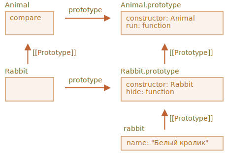

# Статические свойства и методы

Мы также можем присвоить метод самому классу. Такие методы называются статическими. В объявление класса они добавляются с помощью ключевого слова `static`.\
Это фактически то же самое, что присвоить метод напрямую как свойство функции.
- ! Статические методы недоступны для отдельных объектов
```js
class User {
  static staticMethod() {
    alert(this === User);
  }
}

User.staticMethod(); // true
// То же что и
class User { }

User.staticMethod = function() {
  alert(this === User);
};
new User().staticMethod(); /// Error: article.createTodays is not a function
```
Значением `this` при вызове `User.staticMethod()` является сам конструктор класса `User` (правило «объект до точки»).\
[Обычно статические методы используются для реализации функций, которые будут принадлежать классу в целом, но не какому-либо его конкретному объекту.]

## Статические свойства
Они выглядят как свойства класса, но с `static` в начале:
```js
class Article {
  static publisher = "Илья Кантор";
}
```
## Наследование статических свойств и методов
```js
class Animal {
  constructor(name, speed) {
    this.speed = speed;
    this.name = name;
  }
  run(speed = 0) {
    this.speed += speed;
    alert(`${this.name} бежит со скоростью ${this.speed}.`);
  }
  static compare(animalA, animalB) {
    return animalA.speed - animalB.speed;
  }
}
// Наследует от Animal
class Rabbit extends Animal {
  hide() {
    alert(`${this.name} прячется!`);
  }
}

let rabbits = [
  new Rabbit("Белый кролик", 10),
  new Rabbit("Чёрный кролик", 5)
];
 // Чёрный кролик бежит со скоростью 5.
rabbits.sort(Rabbit.compare);
rabbits[0].run();

class Animal {}
class Rabbit extends Animal {}
// для статики
alert(Rabbit.__proto__ === Animal); // true
// для обычных методов
alert(Rabbit.prototype.__proto__ === Animal.prototype); // true
```



Так что `Rabbit extends Animal` создаёт две ссылки на прототип:
1. Функция `Rabbit` прототипно наследует от функции `Animal`.
2. `Rabbit.prototype` прототипно наследует от `Animal.prototype`.
```js
```