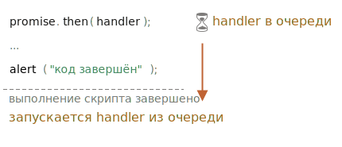

# Микрозадачи

```js
  let promise = Promise.resolve();
  promise.then(() => console.log("promise is resloved"))
  console.log('Code finished')
```
Сначала выполнится код, потом промис.

Асинхронные задачи требуют правильного управления. Для этого стандарт предусматривает внутреннюю очередь PromiseJobs, более известную как «очередь микрозадач (microtask queue)» (термин V8).

Как сказано в спецификации:
- Очередь определяется как первым-пришёл-первым-ушёл (FIFO): задачи, попавшие в очередь первыми, выполняются тоже первыми.
- Выполнение задачи происходит только в том случае, если ничего больше не запущено.

Или, проще говоря, когда промис выполнен, его обработчики .then/catch/finally попадают в очередь. Они пока не выполняются. Движок JavaScript берёт задачу из очереди и выполняет её, когда он освободится от выполнения текущего кода.


- ! Обработчики промисов всегда проходят через эту внутреннюю очередь

Но что если порядок имеет значение для нас? Как мы можем вывести `alert('Code finished)` после `alert('Promise is resolved')`?\
[Используя .then]
```js
Promise.resolve()
  .then(() => alert("промис выполнен!"))
  .then(() => alert("код выполнен"));
```
*"Необработанная ошибка" возникает в случае, если ошибка промиса не обрабатывается в конце очереди микрозадач.*

Обычно, если мы ожидаем ошибку, мы добавляем .catch в конец цепочки промисов, чтобы обработать её.
…Но если мы забудем добавить .catch, то, когда очередь микрозадач опустеет, движок сгенерирует событие:
```js
let promise = Promise.reject(new Error("Ошибка в промисе!"));

// Ошибка в промисе!
window.addEventListener('unhandledrejection', event => alert(event.reason));
```
А что, если мы поймаем ошибку, но позже? Вот так:
```js
let promise = Promise.reject(new Error("Ошибка в промисе!"));

setTimeout(() => promise.catch(err => alert('поймана')), 1000);
// Ошибка в промисе!
window.addEventListener('unhandledrejection', event => alert(event.reason));
```
Теперь, при запуске, мы сначала увидим «Ошибка в промисе!», а затем «поймана».

Но теперь мы понимаем, что событие unhandledrejection возникает, когда очередь микрозадач завершена: движок проверяет все промисы и, если какой-либо из них в состоянии «rejected», то генерируется это событие.

В примере выше .catch, добавленный в setTimeout, также срабатывает, но позже, уже после возникновения unhandledrejection, так что это ни на что не влияет.

Итого:
- Обработка промисов всегда асинхронная, т.к. все действия промисов проходят через внутреннюю очередь «promise jobs», так называемую «очередь микрозадач (microtask queue)» (термин V8).
- Таким образом, обработчики .then/catch/finally вызываются после выполнения текущего кода.
- Если нам нужно гарантировать выполнение какого-то кода после .then/catch/finally, то лучше всего добавить его вызов в цепочку .then.

Также есть специальная функция queueMicrotask(func), которая помещает func в очередь микрозадач.

Согласно спеке сначала должны выполнится промисы добавленные через then и только после этого нужно продолжить
выполнение асинхронной функции. Спека. Для более подробного понимания, почему это так, советую почитать отличную статью на v8.dev
```js
```

```js
```

```js
```

```js
```