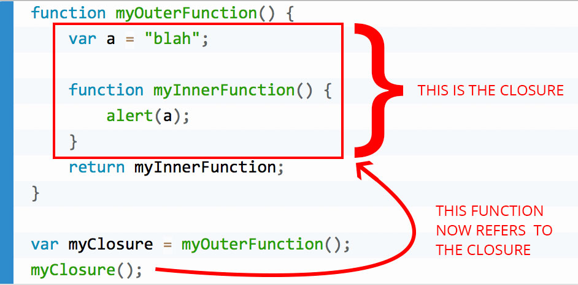

# Scope или Область видимости
Область видимости (или scope) в JS – это как "зона доступа" 🚧 для переменных и функций. Если переменная объявлена глобально 🌍, её видно везде. Локально 🏠 – только внутри функции. А блочная видимость 📦 ограничивает доступ внутри блоков кода, например, внутри циклов или условий.
Область видимости решает проблему хаоса в коде. Без неё, все переменные были бы доступны везде, что приводило бы к ошибкам и конфликтам.

# Колбэк
Колбэк-функция (функция обратного вызова) — функция, предназначенная для отложенного выполнения. Она должна быть выполнена после завершения работы другой функции.
Колбэк-функции используются в асинхронном программировании и позволяют «запланировать» действие, которое будет совершено после выполнения какого-то другого, возможно, длительного действия.

# Ад обратного вызова

Ад обратного вызова (также известный как «пирамида гибели») — это ситуация, когда существует множество вложенных функций обратного вызова, которые делают код сложным и трудночитаемым.
Это происходит в основном в среде асинхронного программирования, например, при обработке асинхронных запросов или файловых операций, когда функция не выполняется в фиксированном порядке.
Обратные вызовы связаны цепочкой внутри обратных вызовов, что делает структуру кода похожей на пирамиду.
Чтобы решить проблему ада обратного вызова, разработчики используют такие методы, как модульность, именованные функции или современные функции, такие как Promises или async/await в JavaScript.

# Промисы

Промис в JavaScript — это объект, который представляет собой результат выполнения какого-либо кода, то есть в буквальном смысле обещание программы вернуть успех или ошибку.

Промисы используют для управления асинхронными операциями — такими, которые не блокируют выполнение последующего кода, пока ожидают завершения. Это может быть запрос к серверу, чтение файлов или что-то ещё, результат чего не доступен сразу же.
Промис может находиться в трёх состояниях:
Pending — ожидание, начальное состояние.
Fulfilled — получен результат.
Rejected — промис отклонён, возникла ошибка.

# Ассинхронность в JS

Асинхронное программирование в JavaScript — стиль программирования, при котором результат работы функций становится известным не сразу, а через некоторое время.

Асинхронная функция — это функция, после вызова которой JavaScript-приложение продолжает работать, потому что функция сразу выполняет возврат. Результат работы асинхронной функции становится известным позже. Чтобы оповестить приложение о полученных значениях, асинхронная функция вызывает другую функцию (callback), которую передают в аргументах при запуске.

Для организации асинхронного кода в JavaScript можно использовать Promise-объекты.

# Рекурсия

Рекурсия в JavaScript — это процесс вызова функцией самой себя.

# Цикл, итерация

Цикл в JavaScript — это метод многократного выполнения одних и тех же манипуляций в процессе работы программы. \
Одно выполнение тела цикла по-научному называется итерация.

# Контекст выполнения

Контекст выполнения – специальная внутренняя структура данных, которая содержит информацию о вызове функции. Она включает в себя конкретное место в коде, на котором находится интерпретатор, локальные переменные функции, значение this (мы не используем его в данном примере) и прочую служебную информацию.

# FIFO планировщик процессов

FIFO (англ. first in, first out «первым пришёл — первым ушёл») — способ организации и манипулирования данными относительно времени и приоритетов. Это выражение описывает принцип технической обработки очереди или обслуживания конфликтных требований путём упорядочения процесса по принципу: «первым пришёл — первым обслужен» (ПППО). Тот, кто приходит первым, тот и обслуживается первым, пришедший следующим ждёт, пока обслуживание первого не будет закончено, и так далее. 

# LIFO 

LIFO (англ. last in, first out, «последним пришёл — первым ушёл») — способ организации и манипулирования данными относительно времени и приоритетов. В структурированном линейном списке, организованном по принципу LIFO, элементы могут добавляться и выбираться только с одного конца, называемого «вершиной списка».[1] Структура LIFO может быть проиллюстрирована на примере стопки тарелок: чтобы взять вторую сверху, нужно снять верхнюю, а чтобы снять последнюю, нужно снять все лежащие выше. \
Самый верхний элемент стека, который добавлен последним, извлекается самым первым. Поэтому такой стек является структурой типа LIFO

# Замыкания

Замыкание – это функция, которая запоминает свои внешние переменные и может получить к ним доступ. В некоторых языках это невозможно, или функция должна быть написана специальным образом, чтобы получилось замыкание. Но, как было описано выше, в JavaScript, все функции изначально являются замыканиями (есть только одно исключение, про которое будет рассказано в Синтаксис "new Function").

То есть они автоматически запоминают, где были созданы, с помощью скрытого свойства [[Environment]], и все они могут получить доступ к внешним переменным.

Все функции в JavaScript являются замыканиями, и, может быть, несколько слов о технических деталях: свойстве [[Environment]] и о том, как работает лексическое окружение.

# Полифил

__Полифил – это термин, который означает эмуляцию метода, который существует в спецификации JavaScript, но ещё не поддерживается текущим движком JavaScript.__

полифил - функции, которые не поддерживаются окружением, но существуют в современном стандарте.

Полифил (polyfill) в JavaScript — это код, написанный на JavaScript, который позволяет использовать новые функции языка, даже если они не поддерживаются старыми или устаревшими браузерами.

Например, если новая версия JavaScript включает новый метод массива, но старый браузер не поддерживает этот метод, можно написать полифил, который добавит этот метод в объект массива. Таким образом, можно использовать новый метод во всех браузерах, включая старые.

Полифилы — это часто используемый инструмент в веб-разработке, потому что они позволяют использовать новые функции языка, не отказываясь от поддержки старых браузеров.

```js
if (!window.Promise) {
  alert("Ваш браузер очень старый!");
  window.Promise = ... // собственная реализация современной возможности языка
}
```
# Хеширование

Хеш-функция получает входные данные и преобразует их в хеш — строку или число фиксированной длины.\
Примеры алгоритмов хеширования: CRC32, MD5 и SHA.\
Хеш (hash) — это уникальный цифровой отпечаток, который можно присвоить любому файлу: коду программы, музыкальному треку, научной диссертации или банковской транзакции.\
Ключевой смысл хеша — убедиться, что данные нельзя изменить или подделать.\
Примеры использования хеша:
- хранение паролей на сайте;
- проверка целостности файлов;
- блокчейн (чтобы гарантировать подлинность транзакций);
- цифровые подписи (чтобы дистанционно подписывать документы без поездок в офисы и встреч с курьерами);
- хеш-таблицы (базы данных, где все данные защищены от перезаписи);
- антивирусы (для хранения вирусов в виде нечёткого хеша, который позволяет искать новые модификации зловредных программ);
- системы контроля версий (Git) (для проверки целостности объектов в репозитории).

# Параметры и аргументы

Параметры в JavaScript — это переменные, разделённые запятыми, указанные в объявлении функции.
Аргументы — это значения, переданные функции при её вызове. Когда функция вызывается, значения переданных аргументов присваиваются объявленным параметрам.

# Директива 
Это описание набора действий, которые должны быть совершены.

# Внешний скрипт

Внешний JavaScript - это когда код JavaScript (script) записывается в другой файл, имеющий расширение .js, а затем мы связываем этот файл внутри тега <head> или<body> нашего HTML-файла, в который этот код должен быть добавлен.
Использование внешнего JavaScript более практично, когда один и тот же код должен использоваться на многих разных веб-страницах.

# Спецификация JS

ECMAScript (или ES) — это спецификация, то есть набор правил и рекомендаций, которые должны соблюдаться языком, чтобы он считался совместимым с этой спецификацией.

JavaScript (или JS) — это язык, который соответствует спецификации ECMAScript.

Разница между ними в том, что документация ES говорит, как создать язык, который будет соответствовать «семейству» подобных ECMAScript-языков, а документация JavaScript — как использовать конкретно этот язык (JavaScript).

https://habr.com/ru/companies/nix/articles/342904/

# ООП Объектно-ориентированное программирование

Когда мы пишем наш код, используя *объекты для представления сущностей реального мира*, – это называется объектно-ориентированным программированием или сокращённо: «ООП».

# Объект в JS

Объект в JavaScript — это тип данных, который может содержать коллекции различных свойств и других более сложных структур. Данные чаще всего объединены общим смыслом, что позволяет оперировать объектом, как единым целым.

Каждое свойство объекта состоит из имени (ключа) и значения, ассоциированного с этим именем. Значением свойства может быть функция, которую можно назвать методом объекта, или любой другой тип.

Объекты в JavaScript являются динамическими. То есть можно изменять свойства объекта: добавлять и удалять их.

Создать объект можно с помощью литеральной записи (список свойств, заключённый в фигурные скобки и разделённый запятыми) 14 или конструктора Object.

# Spec или Спека
Spec это сокращение от specification, т.е. спецификация, описание. В общих словах, это набор функций и макросов, чтобы схематично описывать структуры данных. Например, из каких ключей состоит словарь и каких типов его значения. Такое описание называют спецификацией, или сокращенно спекой.

# Замыкание
